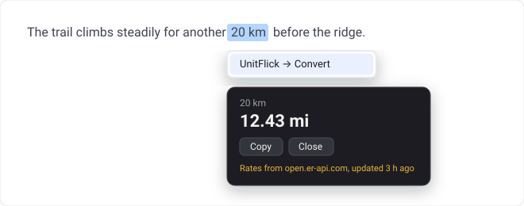

<div align="center">


# UnitFlick

**Highlight a value on any webpage, right-click, and convert it.**

No accounts. No analytics. No dependencies. No API keys to leak.

[](https://github.com/Anshk2009/UnitFlick/actions/workflows/check.yml)
[](LICENSE)
[](manifest.json)
[](package.json)
[](test)



<sub><i>Illustration of the result card, not a screenshot.</i></sub>

</div>

---

```
20 km   →  12.43 mi          72°F     →  22.22 °C
$250    →  225 EUR           ₹5,000   →  $60.24
10 lbs  →  4.54 kg           500 MB   →  0.5 GB
```

Unit conversions are pure arithmetic and never touch the network. Currency is
the only thing that does, and it fetches one public rate table from a fixed
URL — your selection is never sent anywhere.

## Why another converter?

Most of them want a permission on every site you visit, ship an API key in
plain sight, or quietly build a history of everything you highlight. UnitFlick
was built the other way round: work out the smallest thing that could possibly
do the job, then make sure it can't do anything else.

- **It cannot read pages you haven't used it on.** No `*://*/*` permission, no
  always-on content script. `activeTab` is granted per click and expires.
- **There is nothing for a page to talk to.** No message listener anywhere —
  the only entry point is the browser's own context-menu event.
- **There is no key to steal.** The rate provider is keyless by design; a
  provider needing one would have meant running a server.
- **It keeps no history.** One result in session storage, overwritten each
  time, gone when you close the browser.

## Install

Not on the extension stores yet, so load it from source:

```bash
git clone https://github.com/Anshk2009/UnitFlick.git
```

1. Open `chrome://extensions` (or `edge://extensions`)
2. Turn on **Developer mode**
3. **Load unpacked** → pick the cloned folder

Chromium browsers (Chrome, Edge, Brave, Arc, Opera). Firefox is on the roadmap.

## Use it

Highlight → right-click → **UnitFlick → Convert**.

The card appears next to your selection. **Copy** takes the result,
**Escape** dismisses it, and it disappears on its own after 12 seconds. The
toolbar icon shows the last result if you missed it.

UnitFlick picks the target for you: it converts into the measurement system you
are *not* already looking at, biased toward the one you set in preferences.
`20 km` gives miles, `20 mi` gives kilometres.

## What it understands

<table>
<tr><th align="left">Category</th><th align="left">Units</th></tr>
<tr><td>Length</td><td><code>mm</code> <code>cm</code> <code>m</code> <code>km</code> <code>in</code> <code>ft</code> <code>yd</code> <code>mi</code></td></tr>
<tr><td>Mass</td><td><code>mg</code> <code>g</code> <code>kg</code> <code>oz</code> <code>lb</code></td></tr>
<tr><td>Temperature</td><td><code>°C</code> <code>°F</code> <code>K</code></td></tr>
<tr><td>Area</td><td><code>m²</code> <code>km²</code> <code>ft²</code> <code>acres</code></td></tr>
<tr><td>Volume</td><td><code>mL</code> <code>L</code> <code>tsp</code> <code>tbsp</code> <code>cup</code> <code>gal</code></td></tr>
<tr><td>Speed</td><td><code>km/h</code> <code>m/s</code> <code>mph</code></td></tr>
<tr><td>Storage</td><td><code>B</code> <code>KB</code> <code>MB</code> <code>GB</code> <code>TB</code></td></tr>
</table>

Spellings and plurals work too — `kilometres`, `lbs`, `square feet`,
`fahrenheit`, `kph`. So do European decimals: `1.234,56 kg` reads as 1234.56.

**27 currencies:** USD, EUR, GBP, INR, JPY, CAD, AUD, CHF, CNY, SGD, NZD, SEK,
NOK, DKK, PLN, ZAR, BRL, MXN, AED, KRW, HKD, TRY, RUB, THB, IDR, PHP, VND —
by symbol (`$250`, `₹5,000`) or code (`100 USD`).

<details>
<summary><b>Two conventions worth knowing</b></summary>

<br>

**Storage is decimal.** 1 KB = 1000 B, the way network speeds and drive
manufacturers count. Your file manager may show something different because it
uses 1024.

**Ambiguous symbols pick the largest user.** `$` is USD and `¥` is JPY. For
Canadian dollars or yuan, highlight the code instead: `250 CAD`. Guessing from
the page's language would be worse — it would be wrong silently.

</details>

## Settings

Right-click the toolbar icon → **Options**, or the **Settings** link in the popup.

| Setting | Default |
| --- | --- |
| Convert currencies into | USD |
| Preferred unit system | Metric |
| Decimal places | 2 |
| Refresh exchange rates every | 6 hours |
| Enabled conversions | All |

Every value is validated on the way in *and* on the way out, so a corrupted
stored value can never reach the converter.

## Privacy

The short version: unit conversions never leave your device, and currency
conversion makes exactly one request:

```http
GET https://open.er-api.com/v6/latest/USD
```

No query parameters. Nothing from your selection. No cookies
(`credentials: 'omit'`) and no referrer. The whole USD table is downloaded and
the maths happens locally, so the provider cannot tell what you converted or
how much of it — at most once every 6 hours, and never more than once a minute.

Full detail, including exactly what is stored and for how long, is in
[PRIVACY.md](PRIVACY.md).

## Security

Every webpage is assumed hostile, and so is every byte the API returns.

The design and threat model are in [SECURITY.md](SECURITY.md), and the full
0.1.0 review — eight findings, each with severity, fix and retest — is in
[docs/security-audit-0.1.0.md](docs/security-audit-0.1.0.md).

The checklist is executable rather than aspirational:

```bash
npm run audit
```

It fails the build on secrets, `eval`, `innerHTML`, inline scripts, `http://`
URLs, computed fetch arguments, unexpected permissions, a weakened CSP, or a
manifest pointing at a file that isn't there.

## Development

No build step. What is in `src/` is what runs.

```bash
npm test      # 54 tests, Node's built-in runner
npm run audit # 12 security checks
npm run check # both
npm run build # package dist/unitflick-<version>.zip
```

Node 18+. Nothing to install — `package.json` has no dependencies and none
should be added lightly. Icons are generated, not committed as opaque
binaries: `python tools/make-icons.py` regenerates the mark and every icon
size from one set of coordinates (needs Pillow).

<details>
<summary><b>Architecture</b></summary>

<br>

```
manifest.json              permissions, CSP, entry points
src/
  background/
    service-worker.js      context menu — the only entry point
    convert.js             decides what a selection becomes
  content/
    overlay.js             the on-page result card, injected on demand
  converters/
    units.js               unit tables and conversion maths
    currency.js            codes, symbols, rate arithmetic
  services/
    rates.js               the only file that touches the network
  utils/
    parse.js               untrusted text → {value, symbol}
    settings.js            preferences, validated both ways
    format.js              number and timestamp formatting
  popup/                   toolbar popup
  options/                 settings page
tools/
  audit.js                 the security checklist
  build.py                 release packaging
  make-icons.py            icon generator
```

The layers do not reach across each other. `converters/` and `utils/` are pure
functions that never touch `chrome.*` or the DOM, which is why they are easy to
test. Only `rates.js` makes network calls. Only `overlay.js` and the two HTML
pages touch the DOM.

Because `overlay.js` is injected with `executeScript({ func })`, it has to stay
self-contained — no imports, no closure variables.

**Adding a unit** is one line in a table in `units.js`. **Adding a currency**
is one entry in the list in `currency.js`.

</details>

<details>
<summary><b>Permissions, and why each one is there</b></summary>

<br>

| Permission | Why |
| --- | --- |
| `contextMenus` | The right-click menu item |
| `storage` | Settings and the cached rate table |
| `activeTab` | Show the card in the tab you just used the menu in |
| `scripting` | Inject that card |
| `https://open.er-api.com/` | The only host UnitFlick may contact |

Note what is missing: no `tabs`, no `webRequest`, no `cookies`, no host
permission on webpages. `tools/audit.js` fails the build if any of those appear.

</details>

## Roadmap

- [ ] Firefox support (MV3 service-worker and `browser.*` differences)
- [ ] Keyboard shortcut, so the mouse is optional
- [ ] Pick the target unit from the card, not just settings
- [ ] Better handling of ambiguous symbols (`$`, `¥`, `kr`)
- [ ] Compound units — `5 ft 9 in`

## Contributing

[CONTRIBUTING.md](CONTRIBUTING.md) covers setup, house style, and the handful
of things that will get a PR turned down (new dependencies, `innerHTML`, new
permissions, analytics).

Security issues: please use [SECURITY.md](SECURITY.md) rather than a public issue.

## License

[MIT](LICENSE) © Ansh Kashyap
